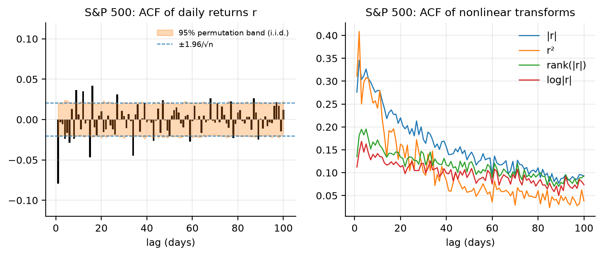
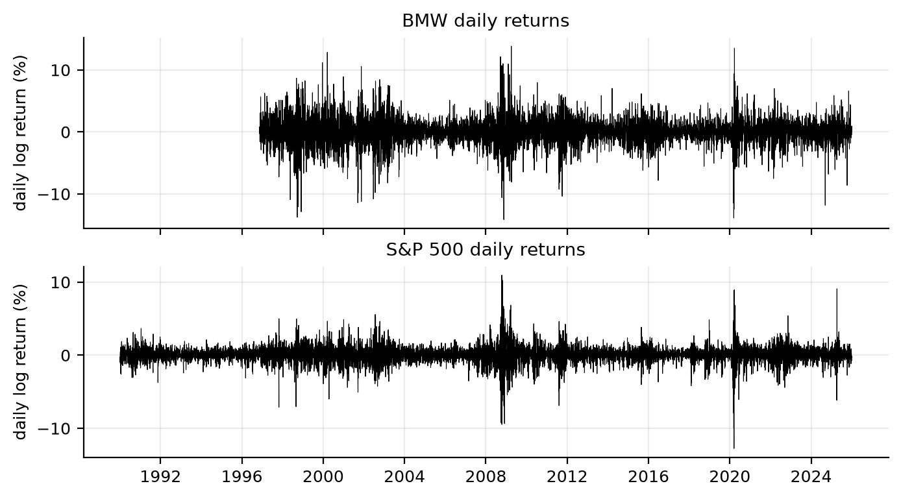
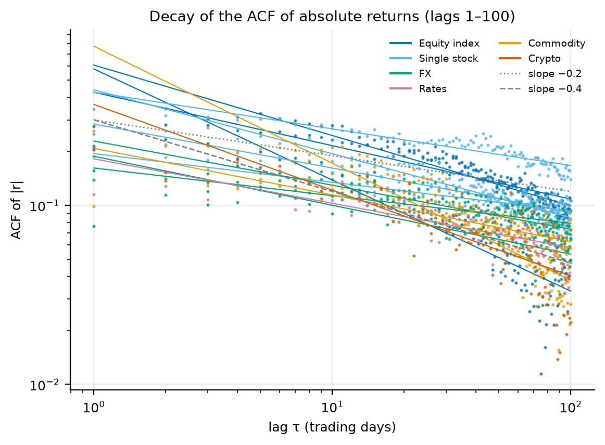
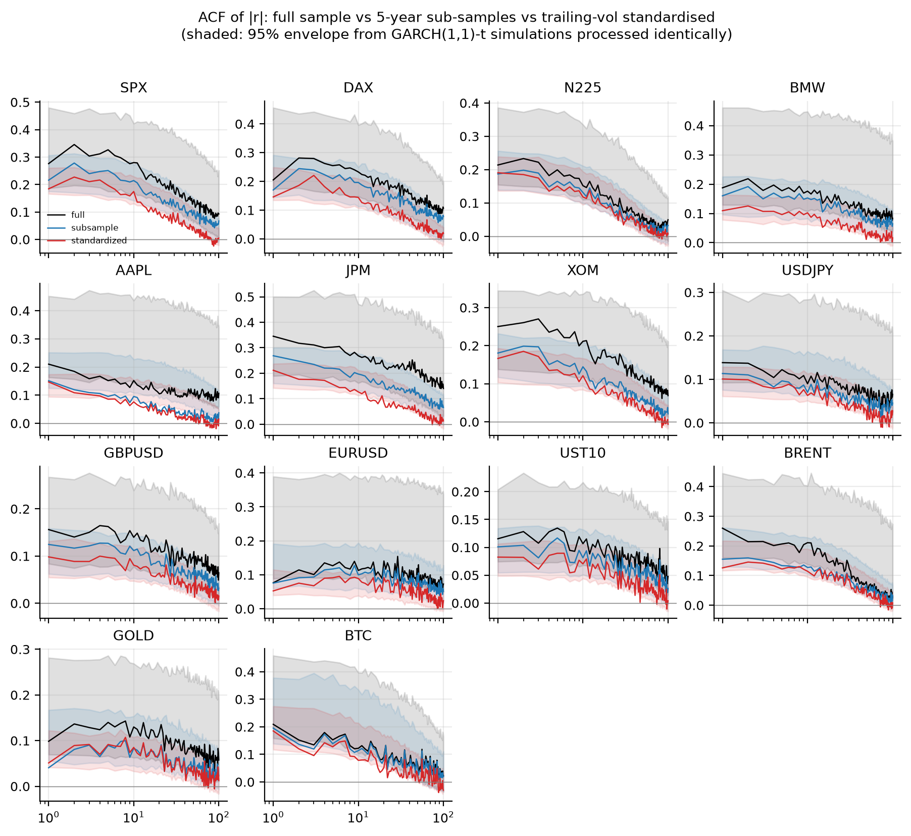
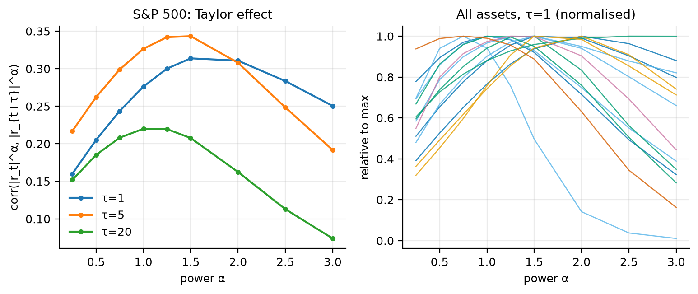
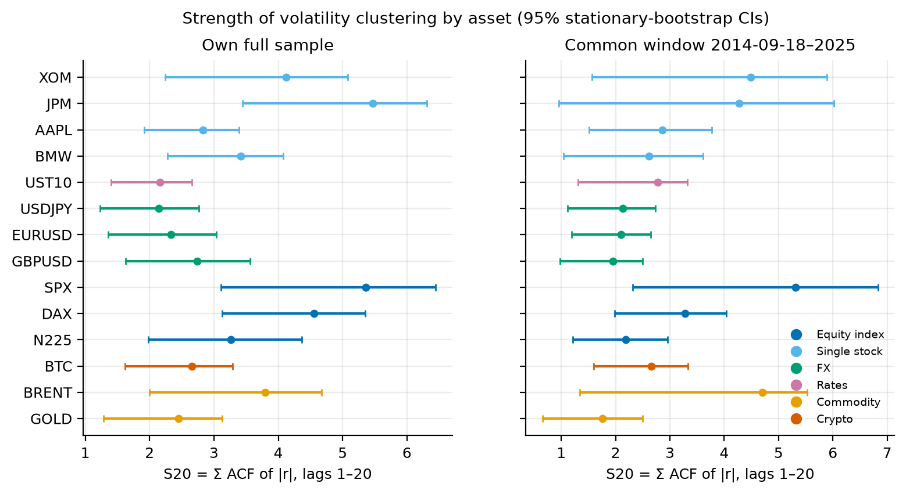
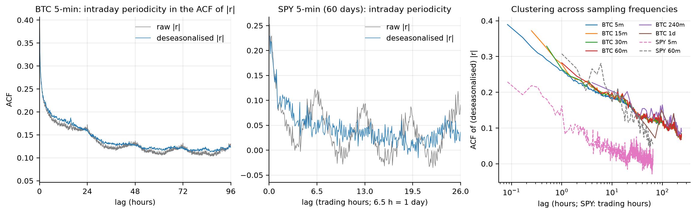
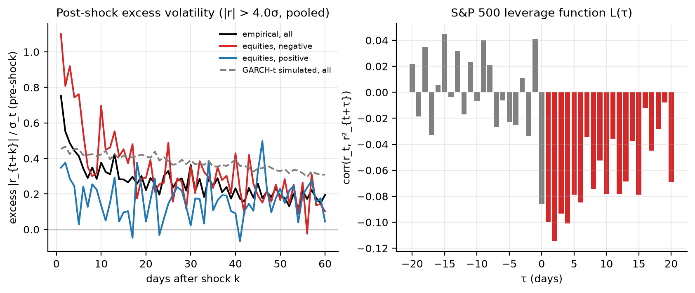
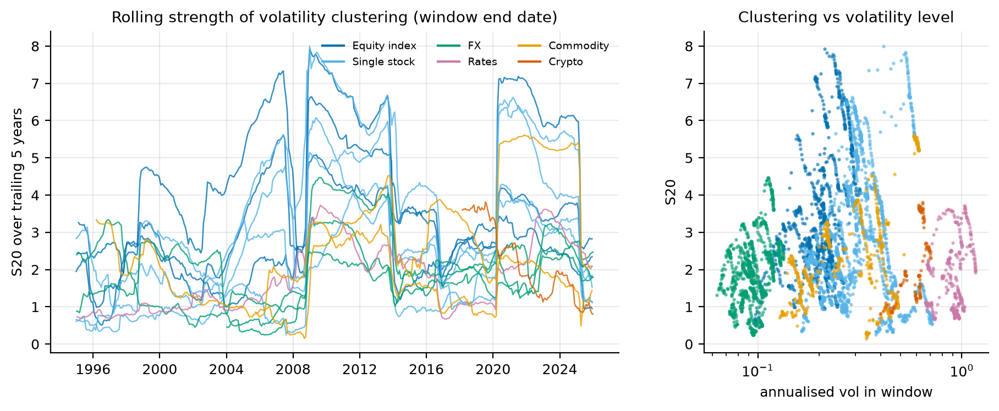
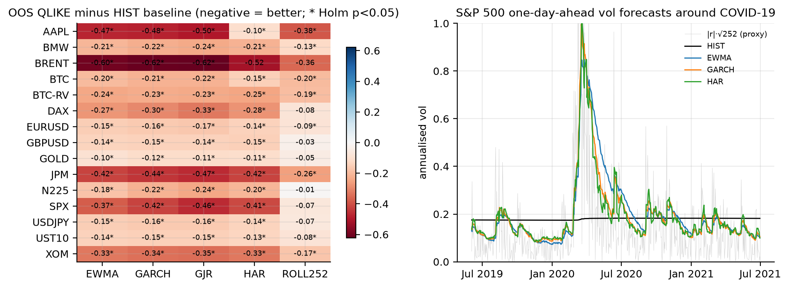

# Volatility Clustering Revisited: A Reproduction and Extension of Cont (2001)

*Research report. Code, configuration and every number in this report are produced by the pipeline in
this repository (`./run_all.sh`). Hypotheses and tests were pre-registered in
`docs/02_research_design.md` before any return series was analysed; deviations are listed in §9.*

---

## Abstract

Cont (2001) lists volatility clustering among the most robust stylized facts of asset returns.
Absolute and squared returns are positively autocorrelated over days to weeks, and the
autocorrelation decays slowly, "roughly as a power law with exponent β ∈ [0.2, 0.4]". We test these
claims on 14 daily series covering six asset classes (1990–2025), 7 years of 5-minute Bitcoin data
and short samples of intraday SPY data. Inference throughout is robust to heavy tails: permutation
tests, block bootstrap and rank autocorrelations.

**What survives.** Clustering itself is universal and overwhelming. The i.i.d. null for |r| is
rejected for all 14 assets at the strongest level 2,000 permutations allow (Holm-adjusted p = 0.007).
Clustering is present at every sampling interval from 5 minutes to 1 month. For Bitcoin, ACFs
computed at 5-minute to daily sampling collapse onto one curve when lags are measured in calendar time.

**What is fragile.** The *shape* of the decay is not identified by these data. A log-log fit on lags
1–100 gives β inside Cont's range for 9 of 14 assets, but on lags 5–250 only 1 of 14. A
log-periodogram estimator does not agree with either fit. An exponential fits better than a power law
for 12 of 14 assets. The long-lag ACF lies inside the 95% envelope of a GARCH(1,1)-t with persistence
≈ 0.99. Removing slow level shifts (sub-samples, trailing-vol standardisation) lowers short-lag
clustering (S20) by roughly 20–40%, and makes the decay steeper for every asset. So "long memory"
cannot be separated from non-stationarity in volatility levels.

**Beyond Cont.**
* After large shocks, excess volatility is front-loaded. It decays faster than a fitted GARCH implies,
  and is three times larger after negative equity shocks than after positive ones.
* Out of sample (2010–2025), every clustering-based forecaster beats a no-clustering baseline under
  QLIKE, significant after Holm correction in 59 of 60 comparisons for EWMA, GARCH, GJR and HAR
  (8 of 15 for the slow-moving rolling-window model).
* The long-memory-mimicking HAR model beats GARCH only when fed a precise realized variance
  (Bitcoin 5-minute RV). On noisy daily squared returns it is never significantly better, and
  significantly worse for 6 of the 14 daily series.
* Economically, clustering-aware volatility targeting cuts the tracking error of realised vs target
  volatility from 4.8 to 1.2–1.7 percentage points, and the maximum drawdown from −20% to about −14%.
  The Sharpe ratio does not improve detectably once costs are included.

---

## 1. Background and literature

Mandelbrot (1963) first noted that "large changes tend to be followed by large changes". Engle (1982)
and Bollerslev (1986) turned this into ARCH/GARCH, under which squared returns follow an ARMA process
whose ACF decays **exponentially** at rate α+β. Taylor (1986) and Ding, Granger & Engle (1993) found
that the ACF of |r|^d is largest near d = 1 and decays much more slowly than a short-memory GARCH
suggests. This motivated long-memory volatility models.

Cont (2001) collects these findings as facts 6 (volatility clustering) and 8 (slow, power-law decay
of the ACF of |r|). He makes two methodological points that this study takes seriously:

1. Heavy tails (tail index ≈ 3–5) can make sample ACFs of |r|^α, and especially of r², converge
   slowly with non-standard confidence bands (Davis & Mikosch, 1998). Classical ±1.96/√n bands and
   Ljung–Box tests are then unreliable.
2. Volatility is latent. Only |r| (or other proxies) can be observed, so "volatility correlation"
   depends on the model.

Cont's conclusion leaves open whether clustering "implies anything interesting from a practical
standpoint for volatility forecasting". Engle & Patton (2001), in the same issue of *Quantitative
Finance*, address exactly this.

A second strand of literature questions the long-memory reading. Lobato & Savin (1998), Granger &
Hyung (2004) and Mikosch & Stărică (2004) show that occasional shifts in the unconditional variance
produce slowly decaying sample ACFs, and near-integrated GARCH estimates (the "IGARCH effect"), even
in short-memory processes. Corsi's (2009) HAR model reproduces apparent long memory with a three-term
cascade (daily, weekly, monthly volatility). It has become the standard benchmark for realized
volatility forecasting (Andersen, Bollerslev, Diebold & Labys, 2003).

## 2. Hypotheses (pre-registered)

| | Hypothesis | Null / test |
|---|---|---|
| H1 | Daily returns have negligible linear autocorrelation (\|ρ_r(τ)\| < 0.05, τ ≥ 2) | Block-bootstrap CI |
| H2 | ρ_{\|r\|}(τ) > 0 for τ = 1..20 | H₀: \|r\| i.i.d. One-sided permutation test on S20 = Σ_{τ=1}^{20} ρ̂_{\|r\|}(τ), Holm over assets |
| H3 | ACF of \|r\| decays as a power law with β ∈ [0.2, 0.4], better than exponential, and not explained by non-stationarity | Log-log slope; power vs exponential SSE; GPH estimate of d; 5-year sub-sample and trailing-vol-standardised ACFs vs GARCH(1,1)-t simulation envelope |
| H4 | Taylor effect: for fixed τ, corr(\|r_t\|^α, \|r_{t+τ}\|^α) is maximised at α ∈ [0.75, 1.25] | Block bootstrap of the arg-max |
| H5 | Clustering strength differs across asset classes | Per-asset bootstrap CIs (descriptive) |
| H6 | Clustering exists at all sampling frequencies; ACFs align in calendar time after deseasonalising | Permutation test per frequency; overlay |
| H7 | After shocks > 4σ, excess vol decays more slowly than GARCH implies, and more slowly after negative shocks | Event study; identical pipeline on GARCH-t simulations; bootstrap over events |
| H8 | Clustering strength varies across calendar regimes | Rolling 5-year S20 (descriptive) |
| H9 | (a) Clustering-based forecasts beat a no-clustering baseline out of sample. (b) HAR beats GARCH/EWMA | Diebold–Mariano (HLN) with Holm; vol-targeting overlay |

**Why a permutation test for H2?** Shuffling |r| destroys all time dependence but keeps the exact
marginal distribution, heavy tails included. The test is therefore exact under the i.i.d. null and
needs no moment conditions. This is the clean answer to Cont's §5.3 critique.

## 3. Data

| Class | Series | Source | Sample | n (returns) |
|---|---|---|---|---|
| Equity index | S&P 500, DAX, Nikkei 225 | Yahoo Finance | 1990–2025 | 8,834–9,106 |
| Single stock | BMW (Cont's Fig. 1 asset), AAPL, JPM, XOM | Yahoo (adjusted close) | 1990/1996–2025 | 7,464–9,066 |
| FX | USD/JPY, GBP/USD (1990–), EUR/USD (1999–) | FRED noon buying rates | to 2025 | 6,769–9,033 |
| Rates | US 10Y yield (daily Δ yield) | FRED DGS10 | 1990–2025 | 9,004 |
| Commodity | Brent spot (FRED), gold front-month futures (Yahoo GC=F) | | 1990/2000–2025 | 8,247 / 6,358 |
| Crypto | Bitcoin (Yahoo, daily, 7 days/week) | | 2014–2025 | 4,123 |
| Intraday | BTCUSDT 5-min klines | Binance public archive | 2019–2025 | 735,580 bars |
| Intraday | SPY 5-min (60 days), 60-min (730 days) | Yahoo, dated snapshot | 2023-11 to 2026-10 | 4,620 / 4,342 |

**Cleaning.**
* Missing and non-positive prices are dropped, **never forward-filled**. A forward-fill creates
  artificial zero returns and biases the ACF of |r| towards zero.
* Returns are taken between consecutive available observations. Intraday returns never span a gap.
* No winsorisation. Every daily move above 25% was checked by hand and is a real event: AAPL −52% on
  2000-09-29, Brent $9.12 on 2020-04-21, BTC −39% on 2020-03-12, oil on 1991-01-17.
* Stale prices: BMW has 20–25 zero returns per year in 1997–2002; elsewhere zeros are < 2.5% of days,
  except for the yield series (8%, from rounding to 1 bp).

Raw files are cached with SHA-256 hashes in `data/raw/manifest.json`.

**Why the data differ from Cont's.** Cont's figures use proprietary high-frequency data: S&P 500
futures 1991–95, USD/JPY ticks, KLM ticks. These are not publicly available. Free multi-year intraday
equity or FX data does not exist in a stable, documented form, so the intraday study uses Bitcoin
(complete, 24/7, no overnight gap) with SPY as a short cross-check. FRED replaces Yahoo for FX because
Yahoo FX history contains stale quotes. WTI is excluded because its negative price on 2020-04-20
makes log returns undefined.

**Survivorship.** AAPL, JPM, XOM and BMW are today's survivors. This biases any statement about
return *levels*, not the existence of clustering, but it does tilt the stock sample towards large,
liquid firms.

## 4. Methodology

**Measures.** Log returns r_t (Δ yield for UST10); a_t = |r_t|. Sample ACF (standard biased
estimator). S20 = Σ_{τ=1}^{20} ρ̂_a(τ) summarises short-run clustering in one pre-chosen statistic,
avoiding 20 separate per-lag tests.

**Heavy-tail-robust inference.**
* Permutation tests (B = 2,000 daily, 500 intraday). The p-value is floored at 1/(B+1).
* Stationary block bootstrap (Politis & Romano, 1994) with mean block length 250 days (§9).
* Rank (Spearman) ACFs. These are invariant to any increasing transform, so |r| and r² give the same rank ACF.

**Decay shape (H3).**
* Power law ρ ~ Aτ^{−β} and exponential ρ ~ Ae^{−τ/τ₀}, each fitted (i) by OLS in logs, as in the
  literature, and (ii) by nonlinear least squares in levels. Compared by SSE in levels.
* GPH log-periodogram estimate of d (bandwidth √n), with implied β = 1 − 2d.
* **Non-stationarity check.** The same three ACFs (full-sample; average over non-overlapping 5-year
  blocks; |r_t|/σ̂₂₅₂(t−1)) are computed on the data and on 200 paths simulated from each asset's
  fitted GARCH(1,1)-t. Applying identical processing to real and simulated data is the key design
  choice: whatever the processing does to a short-memory process, it does to the benchmark too.

**Forecasting (H9).**
* Models: HIST (expanding mean of r²; the "no clustering" baseline), ROLL252, EWMA (λ = 0.94,
  RiskMetrics), GARCH(1,1), GJR-GARCH(1,1) (both normal QMLE, zero mean), HAR (Corsi lags 1/5/22, OLS).
* Walk-forward: out-of-sample 2010–2025 (BTC: 2022–2025). Parameters are refit at every month start
  on an expanding window using only data before that date. **No hyper-parameter is tuned**, so no
  validation set is needed and none can leak.
* Look-ahead control is enforced by a unit test (`tests/test_forecast.py`): multiplying all returns
  after a date t₀ by 5 leaves every forecast dated ≤ t₀ bit-for-bit unchanged, for horizons 1 and 5.
* Target: r² (daily) or 5-minute realized variance (BTC). Losses: QLIKE = log h + y/h (primary) and
  MSE. Both rank forecasts consistently when the proxy is noisy but unbiased (Patton, 2011).
* Tests: Diebold–Mariano with the Harvey–Leybourne–Newbold correction and Newey–West variance (5 lags).
  Holm correction within each family.

**Economic significance.** Volatility targeting on the S&P 500: weight
w_t = min(σ*/σ̂_t, 2) with σ* = 10% annualised, decided at the close of t−1 from the ex-ante
forecast. Costs of 2 and 10 bp per unit of turnover; execution delay of 0 or 1 extra day.

## 5. Results — reproduction of Cont (2001)

### 5.1 H1: no linear autocorrelation (supported)

For every asset, max |ρ̂_r(τ)| over τ = 2..20 is ≤ 0.052 (Brent; all others < 0.05). The lag-1
autocorrelation is distinguishable from zero for four series: S&P 500 −0.079 (95% CI −0.141 to
−0.015), XOM −0.071, Nikkei −0.029 and GBP/USD +0.034. These values are economically tiny next to the
volatility autocorrelations below. **Figure 2** (left) also shows that the classical ±1.96/√n band is
narrower than the permutation band. That is Cont's §5.3 point made visible.

### 5.2 H2: volatility clustering (strongly supported)

| Asset | ρ̂_{\|r\|}(1) | S20 | S20 (rank) | Holm p (perm.) |
|---|---|---|---|---|
| S&P 500 | 0.276 | 5.36 | 3.15 | 0.007 |
| DAX | 0.205 | 4.56 | 3.10 | 0.007 |
| Nikkei 225 | 0.214 | 3.26 | 2.05 | 0.007 |
| BMW | 0.187 | 3.42 | 2.29 | 0.007 |
| AAPL | 0.210 | 2.83 | 2.98 | 0.007 |
| JPM | 0.345 | 5.47 | 3.57 | 0.007 |
| XOM | 0.250 | 4.12 | 2.39 | 0.007 |
| USD/JPY | 0.138 | 2.14 | 1.65 | 0.007 |
| GBP/USD | 0.156 | 2.74 | 1.69 | 0.007 |
| EUR/USD | 0.077 | 2.33 | 1.73 | 0.007 |
| US 10Y | 0.115 | 2.16 | 1.68 | 0.007 |
| Brent | 0.260 | 3.79 | 2.29 | 0.007 |
| Gold | 0.098 | 2.45 | 1.68 | 0.007 |
| Bitcoin | 0.209 | 2.66 | 2.95 | 0.007 |

*(Table `h1_h2`.)* The raw permutation p-value is 1/2001 for every asset: **no shuffle out of 2,000
produced an S20 as large as the observed one**. The Holm-adjusted value 0.007 is 14 × 1/2001, i.e. the
smallest attainable, not a borderline result. The moment-free rank S20 is large everywhere, so the
result does not rest on a few extreme days. Fact 7 (conditional heavy tails) also reproduces:
GARCH(1,1) filtering reduces excess kurtosis for 13 of 14 assets (e.g. AAPL 65.5 → 9.6) but leaves it
well above zero. Bitcoin is the exception (11.8 → 12.2).

*Economic magnitude.* ρ̂_{|r|}(1) ≈ 0.1–0.35. Yesterday's |r| linearly explains only 1–12% of the
variance of today's |r|. The signal is highly significant because n is large, but each single
observation is dominated by noise. This is why the forecasting gains in §6.5 come from *averaging*
many past days.

### 5.3 H3: power-law decay (not supported in a form that can be told apart from alternatives)

| Evidence | Result |
|---|---|
| Log-log slope β, lags 1–100 | median 0.27, range 0.15–0.65; **9/14 inside [0.2, 0.4]** |
| Log-log slope β, lags 5–250 | median 0.59; **1/14 inside [0.2, 0.4]** |
| GPH: β = 1 − 2d | range −0.30 to 0.41; d > 0.5 (non-stationary) for 3 assets; no agreement with log-log β |
| Power law fits better than exponential (SSE in levels) | 1/14 (log-OLS fits); 2/14 (NLS fits) |
| Empirical ACF above GARCH(1,1)-t 97.5% envelope, lags 50–100 | 0% of lags for every asset (full sample) |
| Empirical minus GARCH median ACF, lags 50–100 | −0.08 to +0.01 (at or below the GARCH median) |
| Sub-sample (5-year) ACF: β larger than full-sample β | 13/14; median S20 ratio sub/full = 0.79 |
| Trailing-vol standardised ACF: β larger than full-sample β | 14/14; median S20 ratio std/full = 0.62 |

*(Table `h3_decay`.)* On the usual lag range (1–100), Cont's β range reproduces for most assets.
But the estimate is not stable:
* It roughly doubles when the fit window moves to lags 5–250.
* The log-log plots are visibly **concave**, not straight lines (Fig. 3).
* An independent long-memory estimator (GPH) gives inconsistent values.
* An exponential decay fits the levels better.

Most importantly, the GARCH(1,1)-t fitted to each series has persistence 0.98–1.00, and its simulated
ACFs are at least as persistent as the data at lags 50–100 (Fig. 4). Removing slow level variation
lowers the clustering statistic and steepens the decay for every asset. That is the signature
Mikosch & Stărică (2004) predict when level shifts are present. The near-unit GARCH persistence is
itself the IGARCH effect those authors attribute to the same cause.

**Interpretation.** The pre-registered rule for calling the decay "long-memory-like" is met by
**0 of 14** assets. This is not evidence *against* long memory. The envelope from a near-integrated
GARCH is so wide (Fig. 4, grey) that the test has little power. What the data show is that **slow
decay is real, but its functional form is not identified** by 10–35 years of daily data. This matches
Cont's own cautious wording ("roughly", "sometimes interpreted as a sign of long-range dependence").

### 5.4 H4: Taylor effect (supported at weekly and monthly lags, not at lag 1)

| Lag | Assets with arg-max α ∈ [0.75, 1.25] | Median bootstrap share in [0.75, 1.25] |
|---|---|---|
| τ = 1 | 6/14 | 0.45 |
| τ = 5 | 11/14 | 0.83 |
| τ = 20 | 12/14 | 0.93 |

At τ = 20 the autocorrelation of |r|^α peaks near α = 1, as Ding, Granger & Engle (1993) found. At
τ = 1 the peak is often at α = 1.5–2.5 (S&P 500 1.5, Nikkei 2, USD/JPY 2.5), with wide bootstrap
uncertainty. Cont's related claim that ACF estimates of r² are less reliable than those of |r| gets
**mixed** support: the bootstrap CI of ρ̂_{r²}(1) is wider than that of ρ̂_{|r|}(1) for 8 of 14 assets
(median width ratio 1.11). Note that rank ACFs, which are identical for every α, sidestep the
Taylor-effect question altogether. That suggests part of the effect reflects how moments weight
extreme observations rather than a property of dependence itself.

## 6. Results — beyond Cont (2001)

### 6.1 H5: asset classes (weak, descriptive evidence)

| Class (n assets) | S20, own sample | S20, common window 2014-09 to 2025 | GARCH α+β (common) |
|---|---|---|---|
| Equity index (3) | 4.39 | 3.60 | 0.954 |
| Single stock (4) | 3.96 | 3.56 | 0.963 |
| Commodity (2) | 3.12 | 3.23 | 0.976 |
| Rates (1) | 2.16 | 2.78 | 0.989 |
| Crypto (1) | 2.66 | 2.66 | 0.969 |
| FX (3) | 2.41 | 2.06 | 0.984 |

Equities show the strongest *short-run* clustering, and FX and gold the weakest, in both windows.
However, individual 95% bootstrap CIs overlap heavily (Fig. 6), and with 1–4 assets per class no
population claim about "asset classes" is possible.

The two persistence measures also rank classes in opposite orders. Equities have high S20 but the
*lowest* average GARCH persistence (class means 0.95–0.96, with larger α); FX has low S20 but α+β ≈ 0.98. Put
differently, equity volatility reacts more strongly to news, while FX volatility is weaker but more
slowly moving. "How much clustering" depends on which aspect is measured.

### 6.2 H6: sampling frequency (supported)

* Clustering is significant at every interval tested (permutation, Holm): BTC 5m–1d, SPY 5m and 60m,
  S&P 500 daily, weekly and monthly. ρ̂_{|r|}(1 bar) is 0.39 (BTC 5m), 0.28 (BTC 1h), 0.16 (BTC 1d),
  0.28 (SPX 1d), 0.30 (SPX 1w) and 0.19 (SPX 1M).
* **Calendar-time collapse.** For Bitcoin, the mean ACF of |r| at lags of 1–5 days is 0.121–0.139 for
  every sampling interval from 5 minutes to 4 hours, and 0.112 at daily sampling (Fig. 7, right).
  Clustering is a property of the volatility process in calendar time, not of the sampling grid.
  The near-linear fall of these curves against log(lag) resembles the logarithmic decay
  C(τ) = a ln(b/τ) of multifractal models (Cont eq. 19; Muzy, Delour & Bacry, 2000). That
  observation is post hoc and was not tested.
* **Intraday periodicity.** For SPY 5-minute returns, the raw ACF of |r| has peaks at 6.5, 13 and
  19.5 trading hours, i.e. the same time on following days. Dividing by the time-of-day mean removes
  them (Fig. 7, middle), reproducing Andersen & Bollerslev (1997). Bitcoin's 24/7 market has only a
  mild daily cycle, and deseasonalising changes its statistics by < 0.01.
* Microstructure: ρ̂_r(1) at 5 minutes is −0.031 (BTC) and −0.035 (SPY). This is small negative
  autocorrelation, consistent with Cont's fact 1 at fine scales.

*Weakness:* the SPY samples are short (60 and 730 days) and from 2023–2026, outside the main window.

### 6.3 H7: persistence after large shocks (partly supported; the GARCH comparison is reversed)

384 declustered shocks (|r| > 4σ̂, σ̂ = ex-ante EWMA vol) pooled over all assets. Excess volatility is
measured in units of pre-shock σ̂:

| | n | k = 1 | k = 5 | k = 20 | k = 60 |
|---|---|---|---|---|---|
| All assets | 384 | 0.75 | 0.41 | 0.22 (CI 0.13–0.33) | 0.20 |
| Equities, negative shocks | 124 | 1.10 | 0.76 | 0.29 | 0.10 |
| Equities, positive shocks | 68 | 0.35 | 0.03 | 0.04 | 0.05 |
| GARCH(1,1)-t simulations (same pipeline) | 7,412 | 0.45 | 0.45 | 0.41 | 0.31 |

* Volatility stays elevated for weeks: excess at k = 20 is about 0.2σ and still significant.
  The decay is **front-loaded**: a large immediate jump that halves within about a week, followed by
  a slow plateau. A single exponential fits this shape poorly, so fitted half-lives (36 days pooled,
  CI 25–52) should be read with caution.
* **Reversed versus H7:** a fitted GARCH(1,1)-t implies a *smaller* initial response that decays
  *more slowly*. Real volatility reacts more sharply to big shocks and forgets them faster than a
  single-factor GARCH allows. That is consistent with a two-component (fast + slow) volatility
  structure such as HAR or component GARCH.
* **Leverage asymmetry (supported).** For equities, mean excess volatility over days 1–20 is 0.34σ
  higher after negative shocks than after positive ones (95% CI 0.20–0.50, bootstrap p ≈ 0.0002).
  Positive shocks barely raise volatility beyond day 1. The S&P 500 leverage function
  L(τ) = corr(r_t, r²_{t+τ}) is negative for τ = 1..20 and noise for τ < 0, exactly as in Cont eq. 20.
* Robust to the threshold (3σ: 0.23 at k = 20; 5σ: 0.22) and to the declustering window (60 days: 0.23).

### 6.4 H8: regimes (clustering is strongly time-varying)

Rolling 5-year S20 for the S&P 500 ranges from 0.5 to 7.9. The highest values come from windows that
contain 2008 or 2020. Across assets, rolling S20 is positively correlated with the window's volatility
level for 12 of 14 assets (median correlation 0.57). After standardising by trailing one-year
volatility, sub-period S20 falls sharply in crisis decades (S&P 500 2000–09: 5.98 → 2.98) but much
less in calm ones (2010–19: 3.56 → 2.86).

So measured "clustering strength" is inflated by the large level shifts that crises bring. The same
mechanism drives the non-stationarity finding in §5.3. The result is descriptive: regimes are calendar
windows, chosen ex ante to avoid the selection bias of volatility-sorted samples.

### 6.5 H9: does clustering improve volatility forecasts? (yes, strongly; long memory adds little)

**H9a: clustering vs no clustering.** Out-of-sample QLIKE improvement over HIST (negative = better):

| | EWMA | GARCH | GJR | HAR | ROLL252 |
|---|---|---|---|---|---|
| Significant vs HIST (Holm p < 0.05), of 15 series | 15 | 15 | 15 | 14 | 8 |
| Best model (count) | — | 2 | 11 | 2 | — |

Typical QLIKE gains are 0.1–0.6 per day (S&P 500: GJR −0.46, GARCH −0.42, HAR −0.41, EWMA −0.37).
They hold at a 5-day horizon and with yearly instead of monthly refits (table `h9_robustness`). The
exception is Brent, whose comparisons lose Holm significance in the robustness runs because of
April 2020. Under MSE the same models win on average (S&P 500 MSE ratio vs HIST: 0.74–0.83), but no
difference is significant. MSE on r² is dominated by a handful of extreme days, which is why QLIKE is
the primary loss (Patton, 2011). The asymmetric GJR model is the best single model for 11 of 15
series, linking the forecasting result to the leverage asymmetry of §6.3.

**H9b: long memory (HAR) vs short memory (GARCH/EWMA).** On daily r², HAR is **never significantly
better** than GARCH. It is significantly worse for 6 of the 14 daily series (AAPL, Brent, BTC daily,
DAX, USD/JPY, UST10) and not significantly different for the other 8 (table `h9_har_vs_short_memory`). With a precise realized-variance input (BTC 5-minute RV), **HAR is the best model and beats
GARCH significantly** (ΔQLIKE −0.017, Holm p = 0.006).

The diagnosis is measurement error. With r² as regressor, OLS attenuates HAR's slope coefficients
toward zero. For AAPL the fitted HAR is essentially a constant: intercept 85% of the training mean,
slopes 0.01–0.10, so it is stuck near the 1990s–2000s variance level. Three training days account for
13% of the training sum of squares. The practical implication of "long memory" for forecasting
therefore depends on having a good volatility measurement, not just on the decay shape of the ACF.

**Economic significance (S&P 500 volatility targeting, 2010–2025, 2 bp costs, no delay).**

| Overlay | Realised vol | RMSE of 63-day vol vs 10% target | Max drawdown | Sharpe (rf = 0) | Sharpe at 10 bp | Turnover / yr |
|---|---|---|---|---|---|---|
| Buy & hold | 17.3% | — | −33.9% | 0.74 | 0.74 | — |
| HIST | 9.6% | 4.8 pp | −20.3% | 0.73 | 0.73 | 0.01 |
| ROLL252 | 10.7% | 4.5 pp | −21.0% | 0.68 | 0.68 | 0.6 |
| EWMA | 10.5% | 1.7 pp | −15.3% | 0.74 | 0.69 | 6.6 |
| GARCH | 10.0% | 1.3 pp | −13.7% | 0.77 | 0.71 | 7.4 |
| GJR | 9.9% | 1.2 pp | −13.4% | 0.75 | 0.69 | 8.0 |
| HAR | 9.8% | 1.5 pp | −14.2% | 0.77 | 0.69 | 9.8 |

Clustering-based forecasts make risk targeting work: tracking error falls by about 70% and drawdowns
shrink by about a third. **They do not detectably improve risk-adjusted returns.** The Sharpe
differences (0.68–0.77) are far inside the sampling error of a 16-year Sharpe ratio (s.e. ≈ √((1 + SR²/2)/16) ≈ 0.28).
At 10 bp per unit of turnover every dynamic overlay has a lower net Sharpe than the static HIST
overlay. A one-day execution delay costs about 0.01–0.05 in Sharpe and 0.2–0.3 pp of tracking error.
This matches the out-of-sample scepticism of Cederburg et al. (2020) about volatility-managed
portfolios as an alpha source (cf. Moreira & Muir, 2017). The value of volatility clustering is in
risk management.

## 7. Statistical vs economic significance — summary

| Claim | Statistical evidence | Economic relevance |
|---|---|---|
| Clustering exists (H2, H6) | Overwhelming; exact tests | Large: enables risk targeting |
| Power-law / long memory (H3) | **Inconclusive**; not identified vs short memory with level shifts | Small: HAR ≈ GARCH on daily data |
| Taylor effect (H4) | Supported at τ ≥ 5 only | Minor |
| Asset-class differences (H5) | **Weak** (overlapping CIs, few assets) | Unclear |
| Post-shock persistence, leverage (H7) | Strong for asymmetry; GARCH shape rejected | Moderate: favours asymmetric, multi-component models (GJR best) |
| Forecast gains (H9a) | Strong under QLIKE (59/60); not significant under MSE | Tracking error −70%; Sharpe unchanged; costs matter |

## 8. Robustness checks performed

All pre-registered checks were run:
* ACF transforms: |r|, r², rank, log|r| (Fig. 2).
* Sub-period and standardised ACFs (§5.3).
* Decay fit range [1,100] vs [5,250].
* Shock thresholds 3/4/5σ and declustering windows of 20/60 days.
* Forecast horizon 1 vs 5 days; monthly vs yearly refits; QLIKE vs MSE.
* Costs 2/10 bp and execution delay 0/1 day.
* Intraday with and without deseasonalisation.

The bootstrap block length was also varied (20, 50, 250, 1,000 days).

**Multiple testing.** Families and sizes:
* H2: 14 tests.
* H6: 18 series.
* H9a: 75 comparisons per loss.
* H9b: 30 comparisons.
* H9 robustness: 70 comparisons.
* H7 asymmetry: 2 tests.

All are Holm-adjusted within the family. Descriptive analyses (H5, H8) carry no p-values.

## 9. Deviations from the pre-registration

1. **Bootstrap block length 50 → 250 days.** With 50-day blocks, several point estimates of S20 fell
   at or above their own 95% upper bound. The bootstrap median of S20 rises with block length until
   about 250 days and is stable thereafter (S&P 500: 3.3, 4.3, 5.0 and 5.1 at blocks of 20, 50, 250
   and 1,000). Dependence in |r| extends to roughly a year, which is itself a finding.
2. **Garman–Klass robustness target dropped.** Yahoo's ^GSPC open equals the previous close on
   > 90% of days before 2006 and on some days until 2013, so range estimators are invalid for most of
   the sample. The BTC 5-minute realized-variance target serves as the precise-proxy check instead.
3. **NLS fits added in H3** alongside the pre-specified log-OLS fits, because the estimation and
   comparison criteria should coincide. Added after seeing the log-OLS results. Same conclusion
   (power law better for 1/14 vs 2/14 assets).
4. **Added post hoc:** the common-window comparison (H5) and the "empirical minus GARCH-median"
   statistic (H3).
5. **Leverage asymmetry restricted to equities** as the primary test, because for FX and yields the
   sign of a move is a quoting convention. The all-asset result is also reported and agrees.
6. **Half-life estimator:** the pre-registration named no estimator. An exponential fit was used, but
   the front-loaded shape makes it unreliable, so fixed-horizon excess volatility is the primary statistic.
7. The H3 decision rule "above the GARCH envelope at long lags" was set to "> 50% of lags 50–100"
   in code before the first run.
8. Bitcoin's out-of-sample period starts in 2022, since Yahoo history begins in 2014.
9. A coding error that placed "HAR vs HIST" in the H9b Holm family was found and fixed before results
   were written up.

## 10. Limitations

* **Universe.** 14 daily series is too few to make class-level claims. The stocks are survivors.
  Gold futures carry roll effects; Brent is spot.
* **Intraday.** Equity intraday evidence covers only 60/730 days. The long intraday sample is a
  single crypto pair whose microstructure differs from the 1990s futures markets in Cont's paper.
  BTC deseasonalisation uses full-sample time-of-day means (descriptive only; not used for forecasting).
* **Identification.** Long memory vs level shifts cannot be separated with these tools. The GARCH
  benchmark is itself estimated on non-stationary data. A structural-break test (e.g. ICSS) or a
  Markov-switching benchmark would be needed to go further.
* **Proxies.** Daily forecasts are evaluated against r², which is very noisy. Rankings are consistent
  (Patton, 2011), but power is low under MSE.
* **Inference caveats.** Bootstrap validity under possible infinite fourth moments is not guaranteed.
  Permutation p-values are bounded below by 1/(B+1). DM tests are asymptotic.
* **Economics.** A price index (no dividends), zero cash and financing rates, and proportional costs
  only. The 16-year evaluation window contains few independent volatility regimes.
* **Data snooping.** The analysis was pre-registered, but each deviation in §9 was made after seeing
  some output. All are reported, and none reverses a conclusion.

## 11. Conclusions

1. Cont's core claim, volatility clustering as a universal, model-free property of returns, holds on
   modern data across equities, FX, rates, commodities and crypto. It holds at every sampling
   frequency, and with inference that does not rely on the moment conditions Cont warned about.
2. Cont's quantitative claim of power-law decay with β ∈ [0.2, 0.4] reproduces only for a particular
   lag window. It is not robust, and it cannot be distinguished from a near-integrated short-memory
   process with shifting volatility levels. On this point the evidence is **inconclusive**, which
   matches Cont's own hedging.
3. Cont's open question gets a clear answer. Clustering is practically valuable for **volatility
   forecasting and risk targeting**, with large and robust gains over a no-clustering baseline. It is
   not a source of risk-adjusted return once realistic costs are included. Long-memory structure
   (HAR) adds value only when volatility is measured precisely with intraday data.

## 12. Further research

* Realized-volatility panels for equities and FX (e.g. licensed TAQ or Dukascopy data) to repeat
  H6/H9b with precise proxies across asset classes.
* Explicit structural-break or regime-switching benchmarks to separate long memory from level shifts.
  Local Whittle estimators with break-robust bandwidths.
* Measurement-error-robust HAR variants (HARQ, Bollerslev, Patton & Quaedvlieg, 2016; log-HAR or WLS,
  Clements & Preve, 2021) for daily-data forecasting.
* Two-component (fast/slow) volatility models, motivated by the front-loaded post-shock response.
* A larger single-stock universe including delisted firms (CRSP) to test cross-sectional determinants
  of clustering strength without survivorship bias.
* Model confidence sets (Hansen, Lunde & Nason) instead of pairwise DM tests.

## References

* Andersen, T. G., & Bollerslev, T. (1997). Intraday periodicity and volatility persistence in financial markets. *Journal of Empirical Finance*, 4(2–3), 115–158.
* Andersen, T. G., Bollerslev, T., Diebold, F. X., & Labys, P. (2003). Modeling and forecasting realized volatility. *Econometrica*, 71(2), 579–625.
* Bollerslev, T. (1986). Generalized autoregressive conditional heteroskedasticity. *Journal of Econometrics*, 31(3), 307–327.
* Bollerslev, T., Patton, A. J., & Quaedvlieg, R. (2016). Exploiting the errors: A simple approach for improved volatility forecasting. *Journal of Econometrics*, 192(1), 1–18.
* Cederburg, S., O'Doherty, M. S., Wang, F., & Yan, X. (2020). On the performance of volatility-managed portfolios. *Journal of Financial Economics*, 138(1), 95–117.
* Clements, A., & Preve, D. P. A. (2021). A practical guide to harnessing the HAR volatility model. *Journal of Banking & Finance*, 133, 106285.
* **Cont, R. (2001). Empirical properties of asset returns: stylized facts and statistical issues. *Quantitative Finance*, 1(2), 223–236.**
* Corsi, F. (2009). A simple approximate long-memory model of realized volatility. *Journal of Financial Econometrics*, 7(2), 174–196.
* Davis, R. A., & Mikosch, T. (1998). The sample autocorrelations of heavy-tailed processes with applications to ARCH. *Annals of Statistics*, 26(5), 2049–2080.
* Diebold, F. X., & Mariano, R. S. (1995). Comparing predictive accuracy. *Journal of Business & Economic Statistics*, 13(3), 253–263.
* Ding, Z., Granger, C. W. J., & Engle, R. F. (1993). A long memory property of stock market returns and a new model. *Journal of Empirical Finance*, 1(1), 83–106.
* Engle, R. F. (1982). Autoregressive conditional heteroscedasticity with estimates of the variance of United Kingdom inflation. *Econometrica*, 50(4), 987–1007.
* Engle, R. F., & Patton, A. J. (2001). What good is a volatility model? *Quantitative Finance*, 1(2), 237–245.
* Geweke, J., & Porter-Hudak, S. (1983). The estimation and application of long memory time series models. *Journal of Time Series Analysis*, 4(4), 221–238.
* Glosten, L. R., Jagannathan, R., & Runkle, D. E. (1993). On the relation between the expected value and the volatility of the nominal excess return on stocks. *Journal of Finance*, 48(5), 1779–1801.
* Granger, C. W. J., & Hyung, N. (2004). Occasional structural breaks and long memory with an application to the S&P 500 absolute stock returns. *Journal of Empirical Finance*, 11(3), 399–421.
* Hansen, P. R., & Lunde, A. (2005). A forecast comparison of volatility models: does anything beat a GARCH(1,1)? *Journal of Applied Econometrics*, 20(7), 873–889.
* Harvey, D., Leybourne, S., & Newbold, P. (1997). Testing the equality of prediction mean squared errors. *International Journal of Forecasting*, 13(2), 281–291.
* Holm, S. (1979). A simple sequentially rejective multiple test procedure. *Scandinavian Journal of Statistics*, 6(2), 65–70.
* J.P. Morgan/Reuters (1996). *RiskMetrics — Technical Document* (4th ed.).
* Ljung, G. M., & Box, G. E. P. (1978). On a measure of lack of fit in time series models. *Biometrika*, 65(2), 297–303.
* Lobato, I. N., & Savin, N. E. (1998). Real and spurious long-memory properties of stock-market data. *Journal of Business & Economic Statistics*, 16(3), 261–268.
* Mandelbrot, B. (1963). The variation of certain speculative prices. *Journal of Business*, 36(4), 394–419.
* Mikosch, T., & Stărică, C. (2004). Nonstationarities in financial time series, the long-range dependence, and the IGARCH effects. *Review of Economics and Statistics*, 86(1), 378–390.
* Moreira, A., & Muir, T. (2017). Volatility-managed portfolios. *Journal of Finance*, 72(4), 1611–1644.
* Muzy, J.-F., Delour, J., & Bacry, E. (2000). Modelling fluctuations of financial time series: from cascade process to stochastic volatility model. *European Physical Journal B*, 17(3), 537–548.
* Newey, W. K., & West, K. D. (1987). A simple, positive semi-definite, heteroskedasticity and autocorrelation consistent covariance matrix. *Econometrica*, 55(3), 703–708.
* Patton, A. J. (2011). Volatility forecast comparison using imperfect volatility proxies. *Journal of Econometrics*, 160(1), 246–256.
* Politis, D. N., & Romano, J. P. (1994). The stationary bootstrap. *Journal of the American Statistical Association*, 89(428), 1303–1313.
* Taylor, S. J. (1986). *Modelling Financial Time Series*. Wiley.
